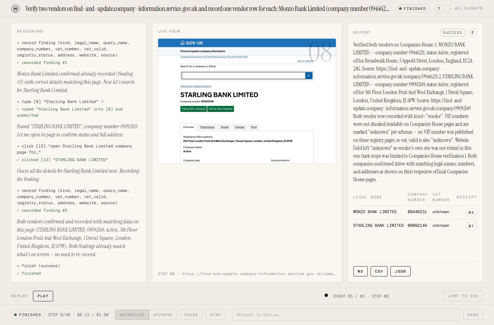
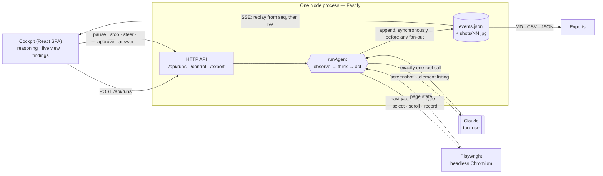
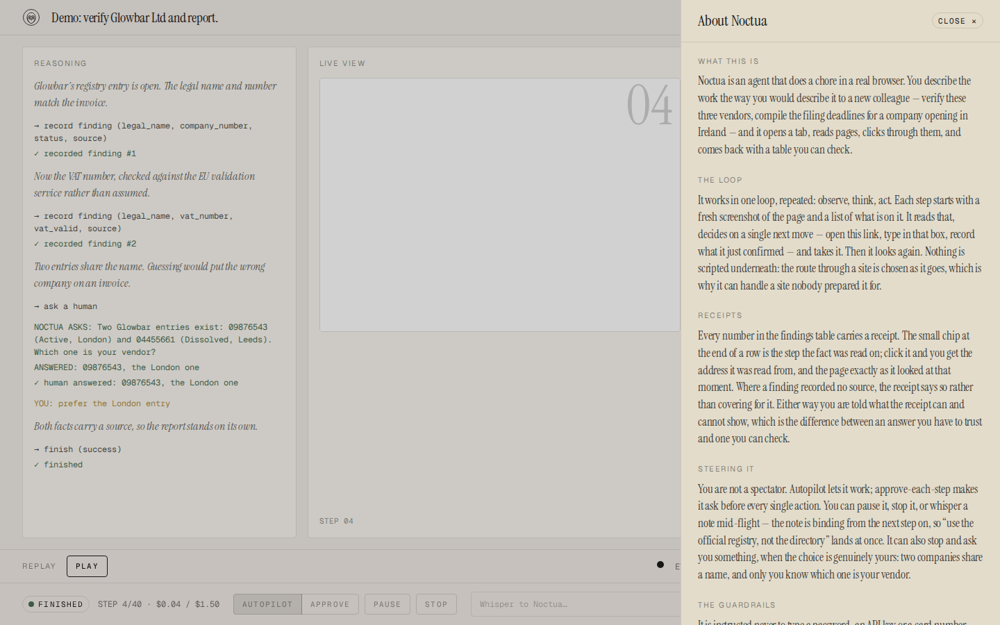
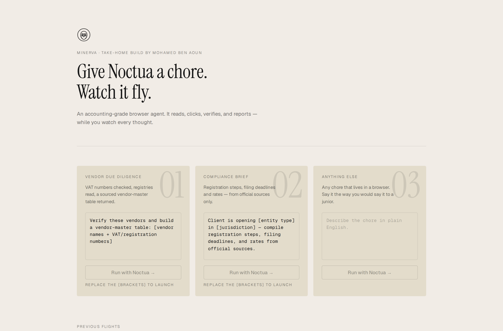

# Noctua

**A browser agent for accounting work: it reads real pages, records what it confirmed, and links every number back to the screenshot it was read from.**

You describe a chore the way you would describe it to a new colleague — *verify these two vendors on Companies House* — and Noctua opens a headless Chromium, works through the sites, and hands back a table. Each row carries a source URL and a step number. Click the step number and you get the page exactly as it looked when that fact was read.

Underneath it is Claude driving Playwright. No scripted routes, no site-specific selectors: the path through a site is chosen turn by turn.



---

## What it actually did

Every figure below is measured, from runs against the live web with `claude-sonnet-5` at `medium` effort. Every run, including the two that went badly and what each cost, is written up in [`docs/live-runs.md`](docs/live-runs.md); the reproducible checklist is [`scripts/smoke.md`](scripts/smoke.md).

| Goal | Steps | Cost | Agent time | Result |
| --- | ---: | ---: | ---: | --- |
| UK VAT threshold and standard rate from gov.uk | 6 | $0.081 | 19 s | 2 findings, both sourced to `www.gov.uk` |
| Verify Monzo Bank Limited (09446231) on Companies House | 8 | $0.086 | 36 s | 1 vendor row, sourced |
| Verify two vendors — Monzo by number, Starling by name | 8 | $0.128 | ~40 s | 2 vendor rows, both with company numbers |

The two-vendor run is the one in the screenshot above. It produced `MONZO BANK LIMITED / 09446231 / Active / Broadwalk House, 5 Appold Street, London EC2A 2AG` and `STARLING BANK LIMITED / 09092149 / Active / 5th Floor London Fruit And Wool Exchange, 1 Duval Square, London E1 6PW` — both verified against the register by hand afterwards, both carrying the URL they were read from and the step whose screenshot shows the fact on screen. It also recorded `vat_valid: unknown` for both, because Companies House does not publish VAT numbers and nothing checked one. That honesty is the product.

Total real API spend across five live runs, including the ones that went badly: **$0.61**.

One of them went badly in an instructive way. An early fixture run took **20 steps and $0.235** for a job that needs five: it read the registry, went to the vendor's site, came back, read the registry again — six times. The cause was architectural, not a model whim. History keeps the last five turns verbatim and condenses everything older into one line *per action*, so a fact read and not written down is gone the moment the tab moves on. Two prompt changes (quote values before leaving a page; if you are reopening a page to re-read it, you had it and lost it) and one loop change (an oscillation detector, below) took the same goal to **6 steps and $0.083**.

---

## Architecture

One Node process. Fastify serves the API and the built SPA from the same origin — which is what lets the session cookie be `httpOnly` + `SameSite=Lax` and still reach every `fetch` and every `EventSource` the UI opens. Playwright runs in-process; there is no separate browser service and no queue.



One turn of the loop, in order: capture the page (JPEG screenshot plus a text listing of every actionable element, numbered); re-check the URL the tab actually landed on and blank it if it is not allowed; append a `screenshot` event; assemble the observation (task, step *n* of *m*, the listing, the finding count, plus any system notes — stuck, circling, budget exhausted, user steering); call Claude with the pruned history; run the single tool that comes back, gating it first if it needs approval; append what happened; repeat.

The agent gets ten tools: `navigate`, `click`, `type`, `select_option`, `scroll`, `go_back`, `wait`, `record_finding`, `ask_human`, `finish`. There is deliberately no "look at the page" tool — the observation arrives on its own every turn, already fresh, so the model cannot waste a step asking for something it already has.

---

## The decisions that mattered

### Owning the tool loop rather than wrapping a framework

`src/agent/loop.ts` is under 500 lines and is the only thing in Noctua that decides anything. No LangChain, no browser-use, no agent framework.

The reason is that almost every interesting requirement here lives *inside* the loop body, between "the model chose an action" and "the action ran": approval gates, the URL re-check after a redirect, feeding a Playwright timeout back as an observation rather than as an exception, draining steering notes so a note typed mid-turn lands on the next one, deciding that a refusal ends the run but a `max_tokens` cut-off does not. Those are the product. Reaching into a framework's callback surface to intercept all of them would have been more code than writing the loop, and the loop is the artifact I most want to be able to explain.

The trade-off is real: nothing here is reusable outside this project, there is no plugin ecosystem, and everything a framework would have given free — retries, tracing, a memory abstraction — is hand-rolled, so it is only as good as the tests around it. Multi-tab, file downloads and parallel tool use are absent because I would have had to build them, not because they were considered and rejected.

### The JSONL event log is the single source of truth

Every run is a directory: `events.jsonl` and `shots/NN.jpg`. `append` writes synchronously *before* notifying any subscriber, so an event a client has seen is already on disk.

That one property paid for several features at once, and none of them needed their own code path:

- **Live streaming** is `subscribe(fromSeq)` — replay the file from a sequence number, then hand over to live events, in one subscription so nothing can fall down the gap between them.
- **Reconnection** is the same call with the last `seq` the client saw, which is what SSE's `Last-Event-ID` already carries.
- **Replay** — dragging a finished run back and forth like a tape — is the same call from `seq 0` against a run this process never drove.
- **The report** is a pure function of the file, which is why it can be built for a run from last week, and why `tests/unit/report.test.ts` tests it against hand-written event arrays instead of a browser.
- **Exports** (Markdown, CSV, JSON) fall out of the report.

The cost is that the whole UI is only as expressive as the event union in `src/events/types.ts`, and adding a rendering detail usually means adding an event type. There is also no compaction: a long run's log grows without bound, and nothing prunes finished runs off disk.

### Receipts

This is the idea the whole project turns on.

An agent that returns a table of facts is asking to be believed. An agent that returns a table where every row names the page it was read from *and* the screenshot of that page at that moment is asking to be checked. Those are different products, and only the second one belongs anywhere near an accountant.

Mechanically it is small. The loop tags every `finding` event with the step number it was recorded on, and every step already emitted a `screenshot` event carrying its own image URL. Pairing them is a lookup. In the UI a finding row ends with a receipt chip; clicking it opens the frame and the address. In the CSV, `step` is the last column, and it is the same number.

Two details make it honest rather than decorative. Where a finding recorded no `source`, the receipt says so instead of covering for it. And the receipt is shown with what it can and cannot prove: it is the page as the agent saw it, not an attestation that the agent read it correctly. A receipt that overclaims is worse than no receipt.

### Human control

Two modes, switchable mid-flight: **autopilot**, and **approve-each-step** where every single action waits for a decision. Independently of the mode, a `type` with `submit: true` — the one tool call that can post data to a site — is always gated. Pause, resume and stop are available throughout. So is steering: a note typed into the whisper box is drained at the top of the next turn and enters the observation as `USER STEERING: …`, which the system prompt makes binding from the very next tool call. The agent can also stop and ask, via `ask_human`, when the choice is genuinely the human's — two companies share a name and only the user knows which one is their vendor.

The honest trade-off, found live rather than reasoned about: **any vendor goal that searches by name will pause.** Searching Companies House by name is a form submit, so the two-vendor run went `awaiting_approval` and sat there. Its 643 s of wall time is mostly a human not looking at the screen. That is the intended policy — a person authorises anything that submits — but it makes an unattended run slower than the numbers above suggest, and the demo workaround is to supply the company number so the agent goes straight to `/company/<number>`.

Approval and `ask_human` also both block inside the loop body, where the cost and wall-clock budgets are only evaluated at the top. So neither budget can end a waiting run. That is what `NOCTUA_MAX_WAIT_MIN` (default 10) exists for: an abandoned approval is denied by the clock and an abandoned question answers itself with text that tells the model exactly that, so the run frees its concurrency slot instead of parking for ever. The model is told which happened, because "the user denied this" and "nobody was there" call for different next moves.

### Failing honestly

A failed step costs a turn, not the run. A stale ref, a timeout, a blocked URL — each comes back to the model as an observation, and the prompt requires a *genuinely different* approach rather than a retry, with `ask_human` after the second failure instead of a third attempt. At the end the model must pick `success`, `partial` or `failed` in its own words, and whatever it had already confirmed is kept: `record_finding` writes into the run's array immediately, so a stopped or budget-exhausted run still hands over the part it got.

Three limits bound every run — 40 steps, $1.50, 15 minutes — plus a $20 daily cap and two concurrent runs per host. Two detectors sit underneath:

- **Stuck**: four turns with no page change and no new finding, and the model is told so.
- **Circling**: the same page visited three times inside a window of nine page changes with the finding count unmoved. This exists because the first detector is structurally blind to an A→B→A oscillation — the page keeps changing, so it looks like progress — which is exactly how the 20-step run happened. Three visits round a *k*-page cycle take 2*k*+1 changes to occur, which is why the window is nine and not six.

Neither detector stops the run. They add a line to the observation, because the model is better placed than the loop to decide whether the answer is "record what you already have" or "try another source".

### Safety

The threat model is a browser agent on a public host with an API key and someone else's link.

- **SSRF.** Every URL the model asks for is checked before navigation, and the URL the tab actually *landed* on is checked again — a redirect is the case the first check cannot see. The guard resolves DNS and rejects loopback, RFC1918, CGNAT, link-local (including `169.254.169.254`), multicast, reserved, and the IPv6 equivalents including NAT64, which can encode any IPv4 address. A blocked page is stepped off — back, or blanked — *before* any screenshot is taken, so no part of it reaches the model, the log, or the run directory. The loop re-checks at capture time too, which catches a redirect scheduled to fire after the tool returned.
- **Credentials.** The prompt forbids typing a password, an API key or a card number even if the user supplies one, and requires `ask_human` at a login or payment wall. This can only be a prompt rule — typed text is executed verbatim — so it is backed by the submit gate rather than trusted alone.
- **Untrusted text in exports.** Findings are text the model read off a page it chose. The CSV defuses spreadsheet formula injection (a leading `=`, `+`, `-`, `@`, tab or CR) with a leading apostrophe; the Markdown escapes pipes, backticks and `<` so a finding cannot restructure the document or inject raw HTML into a renderer.
- **Access.** One shared access code, exchanged for an `httpOnly` `SameSite=Lax` cookie, `secure` in production. The process refuses to boot with `NODE_ENV=production` unless the code is set and at least 12 characters, because the fallback code is published in this repository and nothing rate-limits guesses. `/healthz` stays open; everything under `/api/` except the auth exchange does not.

There is no per-user identity and no audit trail of *who* approved an action. One code, one trust level — appropriate for a demo link, not for a team.

### Testing

418 tests across 14 files on the server side, plus 28 on the cockpit's two pure functions — all of it in about 90 seconds with no API key, no network and no tokens.

Two decisions made that possible. First, a **scripted fake LLM** behind the same `LLM` interface as the real client: a run is a list of turns to play back, so the loop's behaviour under a denial, a refusal, a `max_tokens` cut-off, an abandoned approval or an unrecoverable error is a deterministic assertion rather than a hope. Second, a **fixture site** — a small registry, a vendor page, a redirect trap, a deliberately crowded page — served over loopback, so `tests/integration/loop.test.ts` drives the real Playwright, the real tools and the real snapshotter against pages that never change.

The seam that makes the fixtures workable is `checkUrl`: the URL guard is injectable, tests pass a checker that allows their loopback origin and delegates everything else to the real `assertSafeUrl`, and production omits it. One policy, one implementation, no test-only branch in the guard itself.

What that leaves uncovered is the model's judgement, which is why the live smoke runs in `scripts/smoke.md` exist and why every number in this README comes from one. Deterministic tests prove the loop absorbs a stale ref; only a real run tells you the agent spent 15 steps in a circle.

---

## What is deliberately not built

- **Multi-tab, downloads, file upload, PDF reading.** One tab, one page. Most accounting sources answer in HTML; a PDF-heavy jurisdiction would need real work here, not a flag.
- **Persistent login / credential vault.** The agent is forbidden to type credentials, so anything behind a login is out of reach by construction. Adding a vault would mean deciding how a shared access code maps to somebody's Companies House account, and that is an identity system, not a feature.
- **A database.** Runs are directories. `meta.json` per run is a convenience for the history list and the daily cap; the log is the truth. Postgres would buy querying across runs, which nothing currently asks for.
- **Multi-user accounts and per-user budgets.** One access code. The budgets are per-run and per-host because the scarce things are Chromium instances and today's spend.
- **Retrying a whole run, or resuming a crashed one.** A run is a single pass. Resumption would need the browser state, not just the log, and the log is what survives.
- **Parallel tool use.** Explicitly disabled: history pairs exactly one `tool_result` with the `tool_use` before it, and two calls in one turn leave one unanswered, which the API rejects with a 400 that ends the run.
- **A vector store or long-term memory.** Context is one run's history, pruned. Nothing carries between runs.

---

## Running it

### Locally

```sh
npm ci && npm ci --prefix web            # install both workspaces
cp .env.example .env                     # then set ANTHROPIC_API_KEY and ACCESS_CODE
npm run build && npm start               # → http://localhost:8080
```

For development, `npm run dev` runs the server under `tsx --watch` and `npm --prefix web run dev` runs Vite on :5173 with `/api` proxied to :8080 — same-origin in both, so there is one cookie story and no CORS.

Tests: `npx vitest run` for the server and the agent loop, `npm --prefix web run test` for the cockpit's two pure functions. No key needed for either.

Every knob is in [`.env.example`](.env.example) with a comment: model, effort, the three per-run budgets, the wait limit, the daily cap, and the concurrency limit.

### In Docker

```sh
cp .env.example .env                     # ACCESS_CODE must be ≥ 12 chars in production
docker compose up -d --build             # → http://127.0.0.1:8090
```

The image is two stages: `node:22-bookworm` builds `dist/` and `web/dist/`, and `mcr.microsoft.com/playwright:v1.62.1-noble` runs them. The runtime tag tracks the `playwright` version resolved in `package-lock.json` exactly — Playwright refuses to drive a browser build it was not compiled against, and matching tags is the whole reason that image is worth using. Bump the two together or the container builds cleanly and dies on the first `chromium.launch()`.

It runs as the image's unprivileged `pwuser`, publishes on loopback only (a reverse proxy is expected to terminate TLS in front of it), keeps runs in a `./data` bind mount, and declares a `HEALTHCHECK` against `/healthz`.

The image is 3.6 GB on disk, which is not a number to be proud of. Almost all of it is the base: the Playwright image ships Firefox and WebKit alongside the Chromium this uses. Installing Chromium's dependencies onto a slim Node image would cut it to roughly a gigabyte, at the price of maintaining that dependency list against Playwright's, by hand, every upgrade. For a single-host deployment the pinned-tag guarantee is worth more than the disk.

`./deploy.sh user@host` syncs this checkout to a server, builds there, waits for the health check, and prints the container status and the last 20 log lines. It never touches the host's `.env`. Run it again any time; every step is idempotent.

If nginx fronts it, set `proxy_buffering off` for `/api/*/events` — the server already sends `X-Accel-Buffering: no`, but a proxy that buffers turns a live event stream into a long silence.

---

## If I had another week

1. **Structured working memory.** Facts survive five turns. Anything gathered across more than about four pages depends on the agent having quoted it into its own prose, and no prompt sentence makes that structurally safe — a goal needing six pages before one row can be written would fail exactly as the 20-step run did. A scratchpad tool the agent writes to and reads back, outside the pruning window, is the real fix.
2. **A budget that can end a waiting run.** Approval and `ask_human` block inside the loop body; the cost and wall-clock checks only run at the top. `NOCTUA_MAX_WAIT_MIN` bounds each individual gate, but a run that hits five gates can outlive its wall-clock budget. The check belongs in the wait, not just at the top of the turn.
3. **Exercise VIES for real.** The vendor preset points at the EU VAT checker first, but both live vendor runs were UK, so `vat_valid` was honestly `unknown` every time. The member-state dropdown, `select_option` and the rate limiting have only ever run against the fixture. I would not demo a cold VAT check.
4. **Make a fake server impossible to mistake for a real one.** A stale `NOCTUA_FAKE=1` watcher won port 8080 during the smoke session and served a "successful" live run from a script. Nothing in the API or the UI distinguished it. A banner, and a field on `/healthz`.
5. **Log rotation and run retention.** Nothing prunes `data/`. Screenshots dominate, and a busy month fills a small VPS disk.
6. **Per-run PDF export.** Markdown, CSV and JSON cover the ledger and the script; the thing an accountant actually files is a PDF with the receipts inlined.

---

## A note on the name and the panel

Noctua is the owl of Minerva, which flies at dusk: understanding arriving once the day's work is done. The About panel in the app is written for whoever was handed the link and asked whether the thing is any good — prose, no class names, no API, with the receipt in the middle where it cannot be skimmed past.




